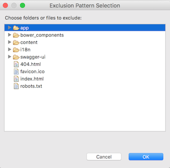

# <i class="fa fa-keyboard-o"></i> Configuring Eclipse

## Import your project

- Select File -> Import
- Choose "Existing Maven Projects"
- Select your project
- Click on "Finish"

## Exclude the ‘node_modules’ folder

- Right-click on Project -> Resource -> Resource Filters
- Select: Exclude all, Applies to folders, Name matches node_modules
- Press "Ok"

## Exclude 'scripts' and 'bower_components' from src/main/webapp

- Right click on Project -> Javascript -> Include path
- Click on the “source” tab and select your_project/src/main/webapp
- Select “Excluded: (None) -> Edit -> Add multiple
- Select `bower_components` and `scripts` and click “Ok”
- You should also exclude
    - `.tmp/`,
    - `node_modules/` and
    - `src/main/webapp/dist` (the `dist` folder will be created when you generate a production build)

