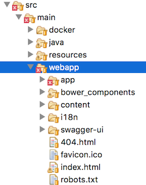

# <i class="fa fa-keyboard-o"></i> Configuring Eclipse

Importing your JHipster in Eclipse will require a few manual steps. You will need to do some configuration:
- on Maven side (for Maven users)
- on Javascript side (so Eclipse can ignore a couple of folders for static files)

## Import your project as a Maven project

- Select File -> Import
- Choose "Existing Maven Projects"
- Select your project
- Click on "Finish"

At the end of the import phase, you might be proposed to "setup Maven plugin connectors" for a plugin called ``maven-processor-plugin``. This is an extension for m2eclipse that has to be installed only once for your Eclipse install. If you have installed it already, you will not need to go through this step.

Note: if you already have an existing JHipster project and have not installed the ``maven-processor-plugin``, you should see the below error:

``Plugin execution not covered by lifecycle configuration: org.bsc.maven:maven-processor-plugin:2.2.4:process (execution: process, phase: generate-sources)

Just select Quick Fix/Ctrl+1 (Cmd+1 on Mac) on the error marker and select "Discover new m2e connectors"

## Excluding generated static folders
At this stage you should not have any Java error but should still see some JavaScript errors. This is because you have some JavaScript files that Eclipse cannot parse properly. Those files are used at execution time only and do not need to be visible in your workspace. They should be excluded.

### Exclude the ‘node_modules’ folder

- Right-click on Project -> Resource -> Resource Filters
- Select: Exclude all, Applies to folders, Name matches node_modules
- Press "Ok"

### Exclude 'scripts' and 'bower_components' from src/main/webapp

- Right click on Project -> Javascript -> Include path
- Click on the “source” tab and select your_project/src/main/webapp
- Select “Excluded: (None) -> Edit -> Add multiple
- Select `bower_components` and `scripts` and click “Ok”
- You should also exclude
    - `.tmp/`,
    - `node_modules/` and
    - `src/main/webapp/dist` (the `dist` folder will be created when you generate a production build)

