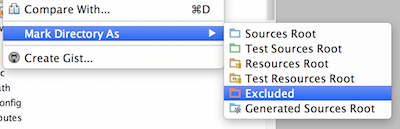

# <i class="icon-keyboard"></i> Configuring Intellij IDEA

## Import your project

- Simply open your project normally
- Maven should be detected, and your project will buid automatically

## Exclude the 'bower_components" from src/main/webapp

- Right-click on the src/main/webapp/bower_components folder
- Select "Mark Directory As" and select "Excluded"

