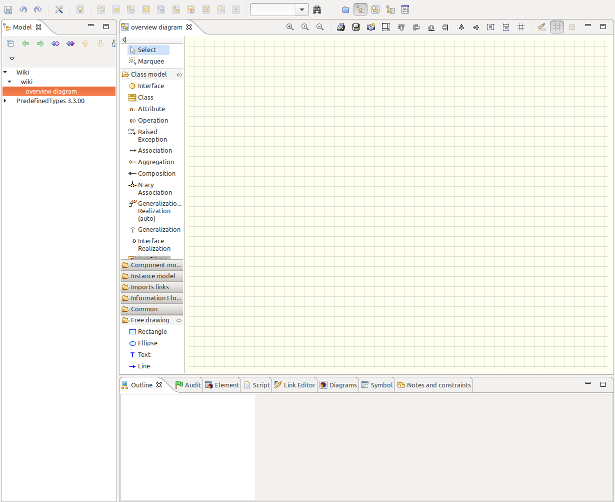
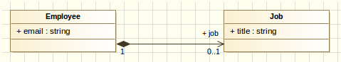
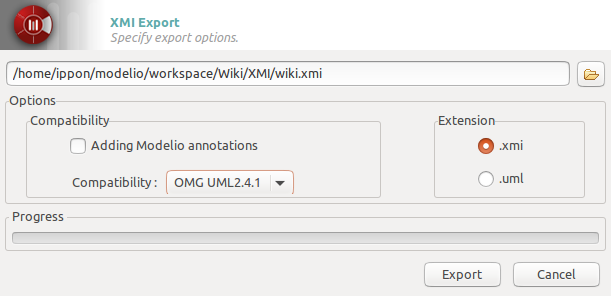
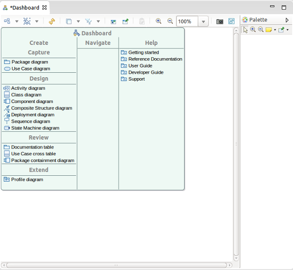

# <i class="icon-magic"></i> JHipster-UML

JHipster-UML is a JHipster sub-project which can be used as a replacement to using the [entity sub-generator]({{ site.url }}/creating_an_entity.html). The idea is that it is much easier to [manage relationships]({{ site.url }}/managing_relationships.html) using a visual tool, than with the classical Yeoman questions and answers.

The JHipster-UML project is [available on Github](https://github.com/jhipster/jhipster-uml), it is an Open Source project like JHipster (Apache 2.0 licence). If you like this project, don't forget to give us a star on Github!

Here's what's covered on this page:

1. [Introduction](#introduction)
2. [Issues and bugs](#issues)
3. [Installation](#install)
4. [How to use JHipster-UML](#howtouse)  
    4.1. [The UML file](#umlfile)  
    4.2. [Use JHipster-UML](#usejuml)  
    4.3. [What's generated](#whatsgenerated)  
5. [Examples](#examples)  
    5.1. [Modelio](#modelioexample)  
    5.2. [UML Designer](#umldesignerexample)  
    5.3. [GenMyModel](#genmymodelexample)  
6. [Testing](#testing-juml)  
7. [Contributing: issues and enhancements](#contributing)  
    6.1. [Parser modifications](#parsermodifications)  
8. [Annexes](#annexes)

***

# Introduction

JHipster-UML is an alternative to the usual Q&A as it offers you the possibility to use a UML editor to create a diagram that will be parsed by JHipster-UML.

Here is a list of the editors we support:

  - [Modelio](https://www.modeliosoft.com/);
  - [UMLDesigner](http://www.umldesigner.org/);
  - [GenMyModel](https://www.genmymodel.com/) (not free);

***

# Issues and bugs

JHipster-UML is [available on Github](https://github.com/jhipster/jhipster-uml), and follows the same [contributing guidelines as JHipster]( https://github.com/jhipster/generator-jhipster/blob/master/CONTRIBUTING.md).

Please use our project for submitting issues and Pull Requests:

- [JHipster-UML issue tracker](https://github.com/jhipster/jhipster-uml/issues)
- [JHipster-UML Pull Requests](https://github.com/jhipster/jhipster-uml/pulls)

***

# Installation
To install JHipster-uml simply use the command:

 `npm install -g jhipster-uml`

If you want the 'bleeding edge' version, you can clone our git repo from [our Github project](https://github.com/jhipster/jhipster-uml):

  `git clone https://github.com/jhipster/jhipster-uml.git` for HTTPS

  `git clone git@github.com:jhipster/jhipster-uml.git` for SSH

***

# How to use it
JHipster-UML is quite easy to use, you need a class diagram exported in XMI and JHipster-UML will parse it to create your entities.

## The UML file

The class diagram should modelize the entities of your JHipster application domain, thus you have restrictions, you have to follow the methodology.

### Entities
Each entity is represented by a class, its fields are the class' attributes. An attribute must have a type supported by JHipster, otherwise it won't work. To have JHipster supported types like “BigDecimal”, “LocalDate”..., you can create a _PrimitiveType_ or a _DataType_ for it.
You can look at the tables with all the types supported by JHipster and the validations you can use for each [here](#annexes).

Here is an example of a properly created class for JHipster. We have the attributes _publicationDate_ and price set with the types _BigDecimal_ and _LocalDate_ we created as _DataType._

Note that you don't need to capitalize type names (**except for composed names like BigDecimal**, JHipster-UML capitalizes simple names).

### Relationships
The relationship between two entities is represented in the class diagram by an aggregation between two classes.

#### One-to-One

Here, we have a one-to-one relationship between Customer and Address, with Customer as the owner of the relationship.

#### One-to-Many

Here, Author has a one-to-many relationship with Book, and Book has a many-to-one relationship with Author.

#### Many-to-Many

Here, we have a many-to-many relationship between Order and Product, with Order as the owner of the relationship.

### A complete example
We use a diagram from the Oracle HR example available [here](http://docs.oracle.com/cd/B28359_01/server.111/b28328/diagrams.htm#G5482).

Here's a screenshot of such a diagram (from Modelio):

As you can see, we changed it as to make it a bit more interesting.
JHipster can generate entities and associations between them (one-to-one, one-to-many, etc.), and in this example we added every type of association (even the reflexive and the inheritance). JHipster doesn't support inheritance yet (but reflexivity is supported by JHipster, with a warning), but we decided to include it in the example so as to have a solid base to work with.

## Use JHipster-uml

Once you have your JHipster application setup and your class diagram in a UML editor, follow those steps:
- step 1 - export your class diagram to the XMI file format
- step 2 - in your JHipster application root folder, execute the command

 `jhipster-uml <your_file.xmi>`

Note that you don't need to supply the database type (sql, mongodb, or cassandra), as JHipster-UML detects the type for you (from the _.yo-rc.json_ file).

If, however, you wish to execute JHipster-UML outside a JHipster app, you need to pass an extra argument: the database type name.
Here is the command to execute:

 `jhipster-uml <your_file.xmi> -db [sql | mongodb | cassandra]`

* step 3 - that's it!

**Note: If you want to use the classes and methods available, the preferred entry point of JHipster-UML is the ParserFactory (so that you don't open the file, read it, find the root element, etc.).**

## What's generated

After executing JHipster-UML, the _.jhipster_ folder will be created (if it didn't exist before) and filled with the entities present in the XMI file in the JSON format.

Please note that one entity may, at least, not be generated: the User entity. It is actually scaffolded by JHipster when creating a new app (and a warning message is displayed by JHipster-UML).

Next, it's pretty straightforward: just run your app!

***

# Examples

Each editor will be discussed here, so that you know how to get a good XMI file.

**Note 1: In every editor: bi-directionality is not allowed, partly because it can lead to wrong diagrams, and partly because JHipster perfectly manages bi-directionality.**

**Note 2: JHipster-UML can detect faulty XMI files, it will display the first error it finds, and exists right away (fail-fast behavior).**

## Modelio

**Note for Mac users: Modelio is behaving weirdly on Mac (the GUI), it may be caused by the graphics and window manager on Mac, as it has not been diagnosed on Linux Ubuntu. It works, but the interaction may not be pleasant.**

Modelio can be downloaded for free [here](https://www.modelio.org/). Make sure you have Java 8 if you're downloading any of the 3.3+ versions (it won't work otherwise).
Once launched, create a project and you'll be seeing this view:

Notice the left panel entitled 'Class Model'. You only need the 'Class', 'Attributes', 'Aggregation', 'Composition' and 'Data Type' objects.
You can already guess why you need the first 2. The 'Aggregation' object is used to defined aggregations:
B is aggregated to A means that A has 0, 1 or more (n) instances of B. A doesn't create (and destroy) B instances.
Composition means that if A is composed of B (0, 1, or n instances), then it creates, manages and destroys B instances.

You can use either of them, the parser will just see the two as associations anyway.

In both situations, cardinalities and association names are important.

Finally, 'Data Types' objects enables you to create custom types (types that are not proposed by Modelio), like `BigDecimal`, or `LocalDate`.

In this example, we'll explain how to connect two classes:

As you can see, employee has a job (but also can have no job at all). The parser will notice a few things:  

  - Two classes (Employee and Job);

  - Two fields (email and title), their type, which class they belong (each class contains its fields). Their visibility is not taken into account;

  - The association linking them and the **direction** of the association (it matters!);

  - The cardinalities (1 and 0..1) mean that an employee can have a job (0 or 1), and a job isn't shared by two employees (only one, for this example's sake);

  - There is one **injected field**: job, in employee.

This association is called a one-to-one. Go back a few sections to see the other types of associations.

Modelio supports constraints. Double-click on a field, go to the 'Notes and constraints' tab, the first icon should then be 'Add a constraint', then select 'Constraint', double-click on the constraint, and give it a name (it should be one of the JHipster constraints). For the constraint value, enter it the 'Body' field.

Finally, once your diagram is finished, you just have to export it.

Check the Model perspective, once you locate your project, get down one level and right click the last element (you lower-cased project's name), XMI, Export XMI. A window should pop up, select the output path, change the compatibility to OMG UML2.4.1, leave the extension to XMI and you're ready to go.

## UML Designer

UML Designer can be downloaded [here](http://www.umldesigner.org/).
It works the same way as Eclipse.
To create an empty project, just click on File -> New -> Modeling Project. Enter the name, and validate.
If no file.uml is created, right-click on your project, and New -> Other -> UML Designer -> UML Model, and enter any name you want.

You'll then be presented by a view like this one:

Double-click on 'Class diagram' under 'Design' category.
You can now see on the right the 'Palette'. You only need these objects: 'Class', 'PrimitiveType', 'DataType' (both under 'Enumeration'), 'Composition' and 'Aggregation' (both under 'Association').

As mentioned with Modelio, our parser system doesn't care if you use an aggregation or a composition. You can use whatever you want.

With UML Designer, you can create custom types by either using a DataType or a PrimitiveType (the parser recognizes both).

Here is an example using this editor:

To create attributes, just double-click on the class, and add your attribute. You can import types by right-clicking somewhere on the diagram (in the white-space), then import Primitive Types, then select UML and Java.
This will spare you the _chore_ of creating types manually (with DataTypes or PrimitiveTypes).

Unfortunately, UML Designer doesn't support constraints yet. A workaround is being studied.

One of the nice things UML Designer provides is that you don't need to export to XMI, just go to your workspace, and you'll see that the saved project is already in the right format, so that's pretty cool.

## GenMyModel
GenMyModel is an in-browser UML editor that can be found [here](https://dashboard.genmymodel.com/). You can use it for free but with restrictions, we hope that this editor will enable users to fiddle around with JHipster-UML without the constraint of downloading an application.

After signing up go in Projects ->  New Projects, give a it name, in Model Type choose UML, in default diagram choose Class Diagram and then click on Create project.
Then this screen will be displayed:

On the panel on the left of the grid, is all the elements possible to make a diagram. We will need only the elements 'Class', 'DataType', 'Attribute', 'Aggregation' 'Composition'. You can use either 'Aggregation' or 'Composition', the parser will only see the association between two classes and its cardinality.

Here is an example how to create two entities with a one-to-many relationship between them and the declaration of the JHipster types through 'DataType':

The parser will notice a few things:

  - Two classes, 'Author' and 'Book'.

  - Two DataTypes, 'LocalDate' and 'BigDecimal'

  - Attributes, you can set the type with the default ones, or with the declared DataTypes.

  - An Aggregation between 'Author' and 'Book' (the direction matters!).

  - Two injected field 'author' in Book and 'book' in Author.

  - The cardinalities (1 and 0..\*) mean that a Book can have one author and an Author can have several books, which correspond to a one-to-many relationship between Author and Book.  

Unfortunately, you can not create custom constraints for attributes to fit the JHipster ones.

Once the diagram is done, you can export it to XMI. To do it, simply click on Tool -> Export as UML (XMI)

***

# Testing JHipster-UML

The tests are available in the test folder and can be run via `npm test`.
We use Mocha for testing (along with expect, chai and expect from chai).

***

# Contributing: issues and enhancements

Because our tool isn't perfect (_yet_), you may notice some irregularities. Github provides a pretty nice issue tracker so that everyone can post about an issue.
We follow the same guidelines as JHipster, with a few additions:
- Bugs found internally (by the JHipster-UML team) may be posted in the issue tracker, except for bugs regarding the supported UML editors.
- The same goes for enhancements.

<b>Note: Post PRs and Issues on JHipster-UML's github page, [here](https://github.com/jhipster/jhipster-uml). Not the main JHipster page.</b>

## Parser modifications

The 1.0.0 release brings a new parser system making any change (parser creation, update, deletion) ultra-easy.

### Adding a parser

#### Parser implementation

Adding a parser is quite easy. If your a Java dev, you're probably quite familiar with OOP principles (we hope so anyway). When developing JHipster-UML, we thought of its architecture as we'd _normally_ do in Java.

You just have to "extend" our abstract parser ([AbstractParser](https://github.com/jhipster/jhipster-uml/blob/master/lib/editors/parser.js#L159)), or implement our interface ([Parser](https://github.com/jhipster/jhipster-uml/blob/master/lib/editors/parser.js#L9)) to add your concrete implementation of a parser.

You should notice that some methods of the Parser interface throw an _UnimplementedOperationException_. This idea is obviously taken from Java, and you can implement this methods in your concrete parser.

Some methods don't throw any exception, but only call other methods. If you're familiar with Java 8, we just copied its awesome default methods, and did the same (so that you don't manually implement them).

Just like in Java, you can override any method you want, and create your own. You're not limited (except if you want to overload).

The AbstractParser class provides some fields, a default constructor and some methods so that you don't have to create or implement them later.

Obviously, you _should_ implement each of these methods (or override the [#parse](https://github.com/jhipster/jhipster-uml/blob/master/lib/editors/parser.js#L11) or [#findElements](https://github.com/jhipster/jhipster-uml/blob/master/lib/editors/parser.js#L23) methods).

The getters are not mandatory, but serve as a way of getting some important fields and provide a way to modify them before sending those fields.

#### Editor detection

When you're done creating your shiny new parser, you should add it to the "list" of available editors:

- Require it first just like [here](https://github.com/jhipster/jhipster-uml/blob/master/lib/editors/editors.js#L3);

- Make it available just like [here](https://github.com/jhipster/jhipster-uml/blob/master/lib/editors/editors.js#L7);

- Add it to the list just like [here](https://github.com/jhipster/jhipster-uml/blob/master/lib/editors/editors.js#L11).

However, a few guidelines must be respected:

- Your parser's name must be \<editor_parser\>;

- The editor's JS file must not be upper-cased, and must not contain any whitespace, (Modelio -> `modelio_parser.js`, UML Designer -> `umldesigner_parser.js`);

- The editor's class name must be capitalized (Modelio -> `ModelioParser`, UML Designer -> `UMLDesignerParser`).

You also must add your editor to the EditorDetector, so that the XMI's editor can be detected, and the XMI parsed.
See [this example](https://github.com/jhipster/jhipster-uml/blob/master/lib/editors/editor_detector.js#L17) to know more about it.

Whether you can identify the editor (mention of it anywhere in the XMI file) or not, you have to put its "editor" name in the EditorDetector like [here](https://github.com/jhipster/jhipster-uml/blob/master/lib/editors/editor_detector.js#L38). It will propose the editor as a choice.

#### Testing

Finally, the next thing you'll need to do before committing your super parser is test it.
Because we believe in testing, but really like good testing (with BDD), our tests are done with Mocha and chai. If you don't know what it's all about yet, we recommend you visit the [ChaiJS](http://chaijs.com/) page, and see [one](https://github.com/jhipster/jhipster-uml/blob/master/test/modelio_parser_test.js) of our test file to get acquainted with it.

You should probably wonder what form of testing you should use. The answer is pretty simple: it's up to you! Whether it's [should](http://chaijs.com/guide/styles/#should), or [expect](http://chaijs.com/guide/styles/#expect) (à la RSpec), we don't enforce any special rule here.

We just want you to test everything that is 'test-worthy':

  - The interface's methods (the _public_ methods);

  - You're not obliged to test the other methods (_private_ ones, because they are supposed to be safe and ever-changing in the long term), but as visibility is not implemented in JS (to our knowledge), you may want to test them (it's up to you).

The general guidelines for names and files:

- Your test file's name should respect the same rules as previously mentioned. For instance, if your parser's name is "Modelio", then your test file should be `modelio_parser_test.js`.

- The same goes for XMI files used for testing. If your parser's name is UMLDesigner, then one of your test XMI file's name can be `umldesigner_parser_problem_test.[...]` (the file extension is not static).

### Modifying a parser

Changing a parser (and then committing the change) is pretty straightforward: just do the change, test it (create tests if need be).

You can make an XMI file if you need a test to pass (exception throwing, or not, etc.).

Don't forget to modify the [editor detector](https://github.com/jhipster/jhipster-uml/blob/master/lib/editors/editor_detector.js#L38) if you change any name.

### Deleting a parser

Removing a parser is quite an easy thing to do.
First, remove it from the editors (`editors/editors.js`). Then, from the EditorDetector (`editors/editor_detector.js`). Finally, just remove the parser file and the test.

Don't forget to modify the [editor detector](https://github.com/jhipster/jhipster-uml/blob/master/lib/editors/editor_detector.js#L38) if you delete any parser

***

# Annexes

Here is the type table (from _types.js_):

<table class="table table-striped table-responsive">
  <tr>
    <th>SQL</th>
    <th>MongoDB</th>
    <th>Cassandra</th>
    <th>Validations</th>
  </tr>
  <tr>
    <td>String</td>
    <td>String</td>
    <td>String</td>
    <td><dfn>required, minlength, maxlength, pattern</dfn></td>
  </tr>
  <tr>
    <td>Integer</td>
    <td>Integer</td>
    <td>Integer</td>
    <td><dfn>required, minlength, maxlength</dfn></td>
  </tr>
  <tr>
    <td>Long</td>
    <td>Long</td>
    <td>Long</td>
    <td><dfn>required, minlength, maxlength</dfn></td>
  </tr>
  <tr>
    <td>BigDecimal</td>
    <td>BigDecimal</td>
    <td>BigDecimal</td>
    <td><dfn>required, minlength, maxlength</dfn></td>
  </tr>
  <tr>
    <td>Boolean</td>
    <td>Boolean</td>
    <td>Boolean</td>
    <td></td>
  </tr>
  <tr>
    <td>LocalDate</td>
    <td>LocalDate</td>
    <td></td>
    <td><dfn>required</dfn></td>
  </tr>
  <tr>
    <td></td>
    <td></td>
    <td>Date</td>
    <td><dfn>required</dfn></td>
  </tr>
  <tr>
    <td>DateTime</td>
    <td>DateTime</td>
    <td></td>
    <td><dfn>required</dfn></td>
  </tr>
  <tr>
    <td></td>
    <td></td>
    <td>UUID</td>
    <td><dfn>required</dfn></td>
  </tr>
  <tr>
    <td></td>
    <td></td>
    <td>TimeUUID</td>
    <td><dfn>required</dfn></td>
  </tr>
</table>
