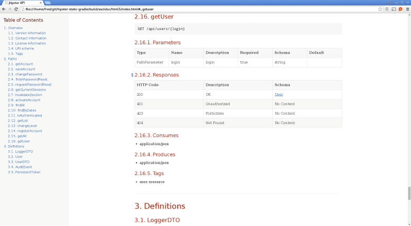

# Static API documentation with Swagger2Markup

__Tip submitted by [@atomfrede](https://github.com/atomfrede)__

> You should use the new [swagger2markup](https://github.com/atomfrede/generator-jhipster-swagger2markup) module instead of following this tip! See the [JHipster Marketplace](http://jhipster.github.io/modules/marketplace.html) for details about the module system.

If you want to generate static API documentation (and combine it with hand-written documentation), [Swagger2Markup](https://swagger2markup.readme.io/) provides an easy way to combine auto-generated API documentation produced by
Swagger with hand-written documentation into an up-to-date, easy-to-read, on- and offline user guide in HTML, PDF and EPUB.

## Add required dependencies, plugins and test class

### Maven

Add the following to your project dependencies:

    <dependency>
        <groupId>io.springfox</groupId>
        <artifactId>springfox-staticdocs</artifactId>
        <version>${springfox.version}</version>
        <scope>test</scope>
    </dependency>

Add the following to the plugin section:

    <plugin>
      <groupId>org.asciidoctor</groupId>
      <artifactId>asciidoctor-maven-plugin</artifactId>
      <version>1.5.2</version>
      <executions>
        <execution>
          <id>output-html</id>
          <phase>test</phase>
          <goals>
            <goal>process-asciidoc</goal>
          </goals>
          <configuration>
            <backend>html5</backend>
            <outputDirectory>${project.build.directory}/docs/html</outputDirectory>
          </configuration>
        </execution>
        <execution>
          <id>output-pdf</id>
          <phase>test</phase>
          <goals>
            <goal>process-asciidoc</goal>
          </goals>
          <configuration>
            <backend>pdf</backend>
            <outputDirectory>${project.build.directory}/docs/pdf</outputDirectory>
          </configuration>
        </execution>
      </executions>
      <dependencies>
        <dependency>
          <groupId>org.asciidoctor</groupId>
          <artifactId>asciidoctorj-pdf</artifactId>
          <version>1.5.0-alpha.8</version>
        </dependency>
      </dependencies>
      <configuration>
        <sourceDirectory>src/docs/asciidoc</sourceDirectory>
        <sourceDocumentName>index.adoc</sourceDocumentName>
        <attributes>
          <doctype>book</doctype>
          <toc>left</toc>
          <toclevels>2</toclevels>
          <generated>${project.build.directory}/docs/asciidoc/generated</generated>
        </attributes>
      </configuration>
    </plugin>

In `src/test/rest` create a new class called `Swagger2MarkupTest`:

    @RunWith(SpringJUnit4ClassRunner.class)
    @SpringApplicationConfiguration(classes = Application.class)
    @WebAppConfiguration
    @IntegrationTest
    public class Swagger2MarkupTest {

        private static final String API_URI = "/v2/api-docs";

        @Inject
        private WebApplicationContext context;

        private MockMvc mockMvc;

        private File projectDir;

        @Before
        public void setup() throws IOException {
            this.mockMvc = MockMvcBuilders.webAppContextSetup(this.context).build();

            ClassPathResource pathfileRes = new ClassPathResource("config/application.yml");
            projectDir = pathfileRes.getFile().getParentFile().getParentFile().getParentFile().getParentFile();
        }

        @Test
        public void convertSwaggerToAsciiDoc() throws Exception {
            Swagger2MarkupResultHandler.Builder builder = Swagger2MarkupResultHandler
                .outputDirectory(outputDirForFormat("asciidoc"));
            mockMvc.perform(get(API_URI).accept(APPLICATION_JSON))
                .andDo(builder.build())
                .andExpect(status().isOk());

        }

        private String outputDirForFormat(String format) throws IOException {
            return new File(projectDir, "target/docs/" + format + "/generated").getAbsolutePath();
        }
    }

### Gradle

Add the following dependency to your project dependencies:

    testCompile group: 'io.springfox', name:'springfox-staticdocs', version: springfox_version

Add the following to your build script dependencies:

    classpath 'org.asciidoctor:asciidoctor-gradle-plugin:1.5.2'
    classpath 'org.asciidoctor:asciidoctorj-pdf:1.5.0-alpha.8'

Apply the `asciidoctor convert` plugin:

    apply plugin: 'org.asciidoctor.convert'

Add the following to generate HTML and PDF:

    ext {
        generatedAsciidoc = file("${buildDir}/docs/asciidoc/generated")
    }

    asciidoctor {
        dependsOn test
        sources {
            include 'index.adoc'
        }
        backends = ['html5', 'pdf']
        attributes = [
            doctype: 'book',
            toc: 'left',
            toclevels: '2',
            numbered: '',
            sectlinks: '',
            sectanchors: '',
            hardbreaks: '',
            generated: generatedAsciidoc
        ]
    }

In `src/test/rest` create a new class called `Swagger2MarkupTest`:

    @RunWith(SpringJUnit4ClassRunner.class)
    @SpringApplicationConfiguration(classes = Application.class)
    @WebAppConfiguration
    @IntegrationTest
    public class Swagger2MarkupTest {

        private static final String API_URI = "/v2/api-docs";

        @Inject
        private WebApplicationContext context;

        private MockMvc mockMvc;

        private File projectDir;

        @Before
        public void setup() throws IOException {
            this.mockMvc = MockMvcBuilders.webAppContextSetup(this.context).build();

            ClassPathResource pathfileRes = new ClassPathResource("config/application.yml");
            projectDir = pathfileRes.getFile().getParentFile().getParentFile().getParentFile().getParentFile();
        }

        @Test
        public void convertSwaggerToAsciiDoc() throws Exception {
            Swagger2MarkupResultHandler.Builder builder = Swagger2MarkupResultHandler
                .outputDirectory(outputDirForFormat("asciidoc"));
            mockMvc.perform(get(API_URI).accept(APPLICATION_JSON))
                .andDo(builder.build())
                .andExpect(status().isOk());

        }

        private String outputDirForFormat(String format) throws IOException {
            return new File(projectDir, "docs/" + format + "/generated").getAbsolutePath();
        }
    }

## Create index.adoc file

Create `index.adoc` in `src/docs/asciidoc` with following content:

    include::{generated}/overview.adoc[]
    include::{generated}/paths.adoc[]
    include::{generated}/definitions.adoc[]

## Generate static documentation

Your static documentation is generated during the test phase of your project. You find it in `src/target/docs/html` or `build/asciidoc/html5`.

## More

For more information (e.g. how to add hand-written documentation) see the [official reference documentation](https://swagger2markup.readme.io/).
