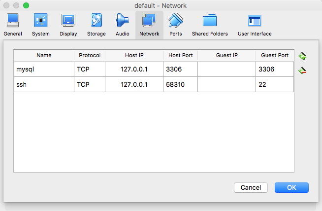

# Using Docker containers as localhost on Mac/Windows

__Tip submitted by [@Akuka](https://github.com/Akuka)__

## Difference between Docker on Linux and Docker on Mac/Windows environments

Based on your OS, your <code>DOCKER_HOST</code> is different.
On Linux, it will simply be your localhost.
For Mac/Windows, you should obtain the appropriate IP using the following command:

```
docker-machine ip default
```

## Motivation

When you generate a new JHipster application, the host address of all the connections configurations (for example: database connection string) is localhost by default.
This means that if you are using Docker to run services (such as a database / elastic search / SMTP server / etc...), you will need to edit your application configuration file and replace the database IP address from localhost to your <code>DOCKER_HOST</code>.

## Port Forwarding

A Docker Machine is a virtual machine running under VirtualBox in your host machine.
We can use the Port Forwarding feature of VirtualBox in order to access the Docker VM as localhost.

To achieve this do the following:


First of all, make sure your Docker Machine is stopped by executing the following:

```
docker-machine stop default     # Your Docker machine name may not be default, in this case change the name accordingly
```

Then:

* Open VirtualBox Manager
* Select your Docker Machine VirtualBox image (e.g.: default)
* Open Settings -> Network -> Advanced -> Port Forwarding
* Add your app name, the desired host port and your guest port

The following is a screenshot with a MySQL Port Forwarding example:




Now you're ready to start your Docker Machine by executing the following:

```
docker-machine start default
eval $(docker-machine env default)
```

Then just start your Docker container and you will be able to access it via localhost.
